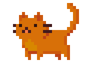
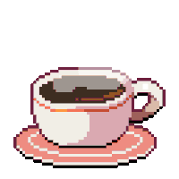

<!-- Banner -->

<!-- Presentación -->
<section style="margin-top:20px;">
  <h2 align="center">👋 ¡Hola mundo! Soy Leandro Valladares</h2>
  

  <article>
     
    Soy Técnico en Programación con una mirada creativa y detallista.
    Me especializo en desarrollo web frontend, donde combino código y diseño para crear experiencias que conectan.
    Me apasiona el arte digital y los mundos narrativos que invitan a sentir y pensar.
    Actualmente estoy aprendiendo ReactJS y explorando el stack MERN, además de ampliar mis conocimientos en PHP, MySQL y WordPress.
  </article>
</section>

<!-- More -->
<section style="margin-top:20px;">
  <h2 align="center">🎨 ¿Qué me define?</h2>
  
  <ul>
     
    <li>🌈 Diseño con propósito: Cada línea de CSS es una pincelada que busca armonía.</li>
    <li>🧠 Curiosidad constante: Siempre estoy aprendiendo algo nuevo, desde frameworks hasta diseños.</li>
    <li>🎮 Creatividad lúdica: Me inspiran los videojuegos y los dibujos.</li>
    <li>🤝 Empatía digital: Me gusta que quienes visitan mis proyectos se sientan cómodos, inspirados y bienvenidos.</li>
  </ul>
</section>

 

<!-- Skills -->
<section style="margin-top:20px;">
  

    <h2 align="center">💻 Lenguajes y Tecnologías</h2>
    

      
    

  

  

    <h2 align="center">🛠️ Herramientas que uso</h2>
    

      
    

  

</section>

<!-- Stats -->
<h2 align="center">📊 Mis estadísticas en GitHub</h2>

  

  

<!-- Bonus -->
<h2 align="center">🧩 ¿Sabías que...?</h2>

> “El código también puede ser arte.”
> Me gusta pensar que cada proyecto es una pequeña historia, y cada diseño una emoción.
