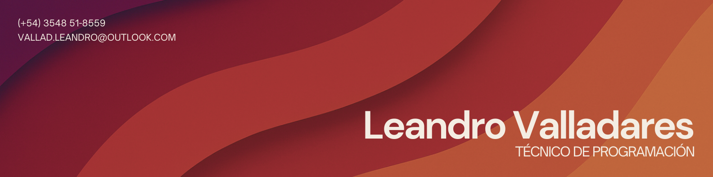

<!-- Banner -->

<!-- Presentation -->
<h2 align="center">¡Hola mundo!</h2>

<section align="justify">
  I’m a student of `Systems Analysis and Development` at the `Federal Institute of Science and Technology of Ceará` **(IFCE)**.  
  My journey in technology started early: at the age of 14, I began programming small 3D games in Unity, and soon after, I immersed myself in the world of 2D games using GameMaker.  
  At 15, I discovered my creative side and worked as a freelance graphic designer, which also fueled my passion for interfaces and visual aesthetics.
  
  When I turned 18 and entered college, I fully dove into programming.  
  Since then, I have been dedicating my time to studying development in depth, with a special focus on `Fullstack Web Development`.  
  Although I study the complete ecosystem, my real strength and the area I enjoy exploring the most is `Front-End`, where I can combine logic, creativity, and design.
</section>

 

<!-- Social Media -->
<h2 align="center">Redes Sociales</h2>

 
  
  
  

 

<!-- Skills -->
<h2 align="center">Lenguajes que utilizo</h2>

  

 

<!-- Others -->
<h2 align="center">Otras Herramientas</h2>

  

